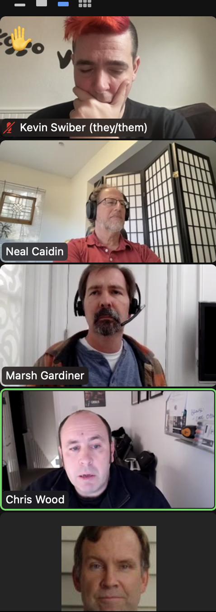

# Planning for 2023 

### OpenAPI Outreach Committee - Fri, Jan 13, 2023

Attending: Marsh G. , Agueda Gama, Jesse, Amber Bennett, Chris Wood, Kevin Swiber, Neal Caidin, Stu Waldron

_This document is a work in progress_

## Strategy and Goals Discussion

* Marsh: We are still working on what makes the community resonate 
* What is a healthy community? Engagement? Numbers of new members? We need more involvement and people participating. AsyncAPI and GraphQL have done a good job, they are co-evolving with tooling. We took the spec out of Swagger, so we are a standard, which is different from software.
* Kevin: difference between open source community and open standards. Open source software tends to have more iterations. A lot is done via email. Should we bring in more tools?
* Stu: We are still struggling with finding relevance 

## Tactics and activities

* Kevin: Idea for partnering with events - mutually beneficial - We could focus on things like an OpenAPI track versus sponsorship, which would be more useful and cost less money.
* Marsh: We should be shining a spotlight - help draw attention to tracks in conferences. We have had good success doing that in the past. 
* Is there a list of API events?? - None for 2023 - Current list is out of date, produced prior to Covid.
* API communities outreach
  * Lorinda and team are looking to do some of those activities
  * Marsh: We should connect with AsyncAPI (async nature connects well with OpenAPI), and GRPC should be transcoded to OpenAPI
* Chris: Pick a vertical! OpenBanking has real interest and is wedding to APIs
  * Marsh: Challenges with gathering data, what do we want to learn? Need a repeatable process.
* Kevin: Invite tooling devs. They should have a say in building the spec.
* Amber: BetterCloud challenge is maintaining other community APIs, staying up to date
* Kevin: Very interested in hearing what Linux Foundation is doing with open standards
* Marsh: Yes, to case studies since incentives drive case studies

Annual report 
* How APIs are being used? Is a huge project, previously considered hiring a firm to do this, problem is how to you get the data, we don’t know tooling, can’t tell - We could do survey but it needs to be more than just a 100 responses
What is the adoption rate of each spec?
* Chris: massive undertaking in terms of gathering data from the community. Not specific of what they are trying to find on who uses the OpenAPI spec and how - have a basis for a database
* More notes [here](https://docs.google.com/document/d/19gLkynTLTJnd4bnHr-dCqLh544M2lAlL1VIIQJTEsw0/edit)

